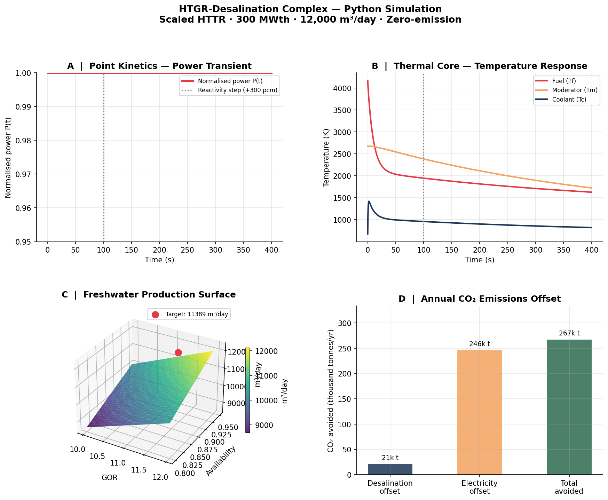

# htgr-desalination

Python simulation of a scaled High-Temperature Gas-Cooled Reactor (HTGR) coupled to a hybrid Multi-Effect Distillation (MED) desalination complex.

Based on the **Imperial College London HTGR / HR group design project (2026)** , a 300 MWth scaled HTTR reactor supplying zero-emission freshwater to 80,000 people while offsetting 267,000 tonnes of CO₂ per year.

The original model was built in MATLAB/Simulink with Python (CoolProp) for real-gas helium properties. This repository ports the core physics into a clean Python package.

---

## Physics Modules

| Module | Description |
|---|---|
| `kinetics.py` | 6-group delayed-neutron point kinetics ODEs |
| `thermal_core.py` | 3-node lumped thermal model (fuel/moderator/coolant) |
| `power_cycles.py` | Helium Brayton + Steam Rankine combined cycle |
| `desalination.py` | MED freshwater production, CO₂ offset, economics |

---

## Reactor Architecture

```
HTTR Core (300 MWth, 950°C He outlet)
    │
    ├── Helium Brayton Cycle (primary)
    │       Compressor → Reactor → Gas Turbine → HRSG
    │
    └── Steam Rankine Cycle (secondary)
            HRSG → Steam Turbine → MED Desalination Plant
                                         │
                                    12,000 m³/day freshwater
                                    ~80,000 people served
```

---

## Installation

```bash
git clone https://github.com/defnalk/htgr-desalination.git
cd htgr-desalination
pip install -r requirements.txt
```

## Quick Start

```python
from htgr import PointKinetics, ThermalCore, MEDDesalination

# Simulate a reactivity transient
pk = PointKinetics(Q_nominal=300e6)
t, P, Q = pk.simulate(t_end=400, rho_step=0.001, step_time=100)

# Check thermal core response
tc = ThermalCore()
print(f"He outlet at nominal: {tc.helium_outlet_temperature(300e6):.1f} K")

# Desalination performance
med = MEDDesalination(GOR=11.1)
print(f"Daily production:  {med.daily_production():,.0f} m³/day")
print(f"Population served: {med.population_served():,} people")
print(f"CO₂ avoided:       {med.co2_saved_annual()['total_t_yr']:,} t/yr")
```

## Run the Full Simulation

```bash
python examples/full_simulation.py
```

Produces a 4-panel figure:



**Panels:**
- **A** — Point kinetics power transient (reactivity pulse)
- **B** — Core temperature response (fuel / moderator / coolant)
- **C** — 3D freshwater production surface (GOR × availability)
- **D** — Annual CO₂ emissions offset breakdown

## Running Tests

```bash
python -m pytest tests/ -v
```

21 tests, all passing.

## Key Design Parameters (from group report)

| Parameter | Value |
|---|---|
| Reactor thermal power | 300 MWth |
| Helium flow rate | 105 kg/s |
| Core outlet temperature | 950 °C |
| Combined cycle electrical output | 30–50 MWe |
| MED GOR | 11.1 |
| Daily freshwater production | ~11,400 m³/day |
| Population served | ~80,000 |
| Annual CO₂ offset | 267,000 t/yr |
| 30-year CO₂ saving | ~8 million t |
| Project IRR | 27% |
| CAPEX payback | 4.3 years |

## Physics Background

### Point Kinetics

The reactor neutron population is governed by 7 coupled ODEs — one for normalised power P(t) and six for delayed-neutron precursor groups Cᵢ(t):

```
dP/dt  = [(ρ(t) − β) / Λ] P + Σ λᵢ Cᵢ
dCᵢ/dt = (βᵢ / Λ) P − λᵢ Cᵢ
```

For subcritical-prompt insertions (ρ < β), a reactivity pulse produces a characteristic power spike followed by return to equilibrium — exactly as validated in the group report against HTTR literature data.

### Thermal Core

Three lumped nodes (fuel Tf, moderator Tm, coolant Tc) with energy balance ODEs and negative temperature feedback coefficients (Doppler + moderator), ensuring inherent passive safety.

### Why Combined Cycles?

The Helium Brayton cycle extracts work from 950 °C exhaust; the Steam Rankine bottoming cycle captures residual heat at 673 °C, providing the precise steam quality (70 °C, 0.31 bar) required for Multi-Effect Distillation. Combined Carnot efficiency: **72%** vs 24.5% for Brayton alone.

## References

- IAEA Nuclear Desalination programme
- HTTR design documentation (Japan Atomic Energy Agency)
- Smith, Van Ness & Abbott — *Chemical Engineering Thermodynamics*
- El-Dessouky & Ettouney — *Fundamentals of Salt Water Desalination*
- Imperial College HTGR 5 / HR 5 Group Report (2026)

## Authors

**HTGR subteam:** Muhammad Dani, Michal Krasowski, Qiji Zhang, Clayton Yeung  
**HR subteam:** Oscar Chan, Heidi Chong, Oliver Bush, Muhammad Abubakar, Luca Faillace  
**Python port:** Defne Ertugrul — MEng Chemical Engineering, Imperial College London
